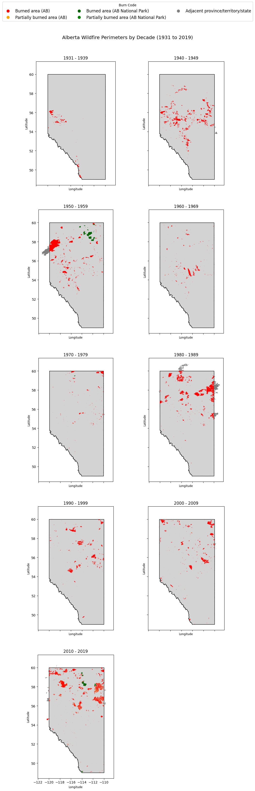

# This repo contains maps of AB's recorded wildfires from 1931-2019. It also contains some code for identifying some BURNCODE classification data issues found in the Alberta wildfire perimeters dataset.

- The Alberta wildfire perimeters dataset can be found here: https://www.alberta.ca/wildfire-maps-and-data (Historical Wildfire Perimeter Data: 1931 to 2022)
- The Canadian provincial shapefiles dataset obtained from the 2016 census, from which the Alberta boundary is extracted, can be found here: https://open.canada.ca/data/en/dataset/a883eb14-0c0e-45c4-b8c4-b54c4a819edb
- 2021 provincial shapefiles are also available via a different interface: https://www12.statcan.gc.ca/census-recensement/2021/geo/sip-pis/boundary-limites/index2021-eng.cfm?year=21

2020 data and beyond was omitted due to a sudden drop in reported fire frequency (most likely due to the pandemic). 

Additionally, 217 wildfire perimeter issues were detected in the categorization of the BURNCODEs, using spatial intersections. 168 of these issues are due to wildfire perimeters that straddle the province's border. These issues have not been modified in the visualization, but the ab-wildfire-perimeters-burncode-correction.py script is a good starting point for fixing these identified issues. NOTE: 
- B, PB, I, B_NP, PB_NP, and I_NP BURNCODEs were all considered to be within the province for this analysis. Other burncodes for Northwest Territories, Saskatchewan, British Columbia, and Montana are considered to be outside the province.
- Some portion of these 168 wildfire perimeters that straddle the border may be considered minor overlaps that are insignificant (additional validation is required). 
- The remaining 49 issues are forest fire perimeters that cleanly fall on the wrong side of the Alberta border, for which they are labeled. These should be validated, but should be more straight-forward to evaluate.

